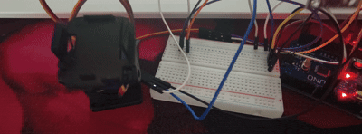

# MPU9250 Servo Gimbal / 陀螺仪跟随云台
## 演示



基于 Arduino Uno、MPU9250 和两个舵机实现的陀螺仪跟随云台。

## 项目简介

本项目使用 Arduino Uno 读取 MPU9250 陀螺仪数据，通过积分得到俯仰角（Pitch）和横滚角（Roll），
再驱动两个舵机组成二自由度云台，使云台跟随陀螺仪的姿态移动。

## 硬件清单

| 元件 | 数量 | 说明 |
|------|------|------|
| Arduino Uno | 1 | 主控板 |
| MPU9250 | 1 | 九轴姿态传感器（本项目仅使用陀螺仪部分） |
| 舵机（SG90 或类似） | 2 | 分别控制俯仰和横滚 |
| 面包板 / 杜邦线 | 若干 | 用于连接 |
| 外部 5V 电源 | 1 | 建议给舵机单独供电 |

> 注意：两个舵机同时工作电流较大，建议使用外部 5V 电源给舵机供电，并与 Arduino 共地，避免 Arduino 板载稳压器过载。

## 接线说明

### 引脚分配

| 模块 | 引脚 | 连接到 Arduino Uno |
|------|------|-------------------|
| MPU9250 | VCC | 3.3V |
| MPU9250 | GND | GND |
| MPU9250 | SCL | A5 |
| MPU9250 | SDA | A4 |
| 舵机1（俯仰） | 信号（黄/橙） | D9 |
| 舵机1（俯仰） | VCC（红） | 5V（建议外部电源） |
| 舵机1（俯仰） | GND（棕/黑） | GND |
| 舵机2（横滚） | 信号（黄/橙） | D10 |
| 舵机2（横滚） | VCC（红） | 5V（建议外部电源） |
| 舵机2（横滚） | GND（棕/黑） | GND |

### 接线示意图

```
┌─────────────────┐
│    ARDUINO UNO  │
│                 │
│   [USB]         │
│                 │
│   D13 □         │
│   D12 □         │
│   D11 □         │
│   D10 □───────┐ │◄── 舵机2 信号线（横滚）
│    D9 □──────┐│ │◄── 舵机1 信号线（俯仰）
│    D8 □      ││ │
│    D7 □      ││ │
│    D6 □      ││ │
│    D5 □      ││ │
│    D4 □      ││ │
│    D3 □      ││ │
│    D2 □      ││ │
│   GND □◄─────┼┼─┼── MPU9250 GND ── 舵机1 GND ── 舵机2 GND
│   AREF□      ││ │
│   SDA □◄─────┘│ │     ▲
│   SCL □◄──────┘ │     │
│                 │     │
│   ICSP  □□□□    │     │
└─────────────────┘     │
      │                 │
┌─────┴─────────────────┘
│
│   5V ◄──────────────────── 舵机1 VCC ── 舵机2 VCC
│  3.3V ◄─────────────────── MPU9250 VCC
│  GND  ◄───────────────────（已接上方GND，无需重复）
│  A5/SCL ◄───────────────── MPU9250 SCL
│  A4/SDA ◄───────────────── MPU9250 SDA
│
└─ 排针扩展或面包板

┌─────────────┐
│   MPU9250   │
│  ┌───────┐  │
│  │VCC GND│◄─┼── 3.3V, GND
│  │SCL SDA│◄─┼── A5, A4
│  │AD0 INT │  │
│  │FSYNC NCS│ │
│  └───────┘  │
└─────────────┘

┌─────────────┐     ┌─────────────┐
│  舵机1(俯仰) │     │  舵机2(横滚) │
│  ┌───────┐  │     │  ┌───────┐  │
│  │棕 红 黄│◄─┼──GND,5V,D9     │  │棕 红 黄│◄─┼──GND,5V,D10
│  └───────┘  │     │  └───────┘  │
└─────────────┘     └─────────────┘
```

> 说明：MPU9250 的 AD0 引脚接地时 I2C 地址为 `0x68`，与代码中 `#define MPU_ADDR 0x68` 一致。若 AD0 接 VCC，地址变为 `0x69`，需同步修改代码。

## 代码说明

完整代码见 `mpu9250_servo_gimbal.ino`。

### 主要逻辑

1. **初始化**
   - 启动 I2C 总线（SDA=A4，SCL=A5）
   - 唤醒 MPU9250（向 `0x6B` 写入 `0x00`）
   - 设置陀螺仪量程为 ±250°/s（向 `0x1B` 写入 `0x00`）
   - 两个舵机分别连接到 D9 和 D10

2. **循环读取与积分**
   - 通过 `micros()` 计算时间间隔 `dt`
   - 从 `0x43` 开始连续读取 6 字节陀螺仪数据（X/Y/Z 三轴）
   - 将原始值除以灵敏度系数 `131.0` 得到角速度（°/s）
   - 对角速度积分得到俯仰角 `pitch` 和横滚角 `roll`

3. **舵机输出**
   - 以 90° 为中位
   - `pitch` 乘以 3 倍放大系数后映射到舵机1
   - `roll` 乘以 3 倍放大系数后映射到舵机2
   - 使用 `constrain()` 限幅在 0~180°

### 核心代码片段

```cpp
pitch += gx * dt;
roll  += gy * dt;

servoPitch.write(constrain(90 - (int)(pitch * 3), 0, 180));
servoRoll.write(constrain(90 + (int)(roll * 3), 0, 180));
```

## 使用方法

1. 按照接线图连接 MPU9250 和两个舵机。
2. 用 Arduino IDE 打开 `mpu9250_servo_gimbal.ino`。
3. 选择开发板 **Arduino Uno** 和对应端口。
4. 点击上传。
5. 上电后，转动 MPU9250，云台会跟随姿态变化。

## 注意事项

- 陀螺仪积分会产生**漂移**，长时间运行角度会逐渐偏移。若需要更稳定的姿态，可加入加速度计数据做互补滤波或使用 Madgwick / Kalman 滤波。
- 舵机供电建议独立 5V，避免 Arduino 板载 5V 稳压器过载导致复位。
- MPU9250 工作电压为 3.3V，请勿接 5V，否则可能损坏模块。
- 若使用 MPU6050，代码中的寄存器地址和逻辑基本兼容，但需确认 I2C 地址。

## 可改进方向

- 加入加速度计数据，使用互补滤波减少漂移
- 加入 MPU9250 磁力计，实现偏航角（Yaw）控制
- 使用 PID 控制让云台跟随更平滑
- 增加死区，避免舵机在微小抖动时频繁动作

## 许可证

本项目采用 [MIT License](LICENSE) 开源。
